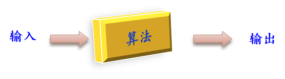
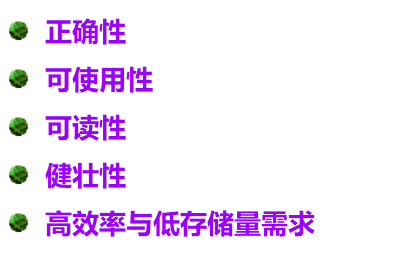
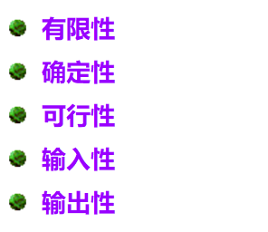
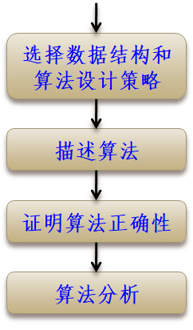
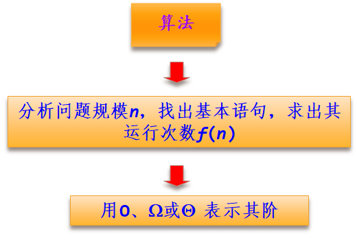
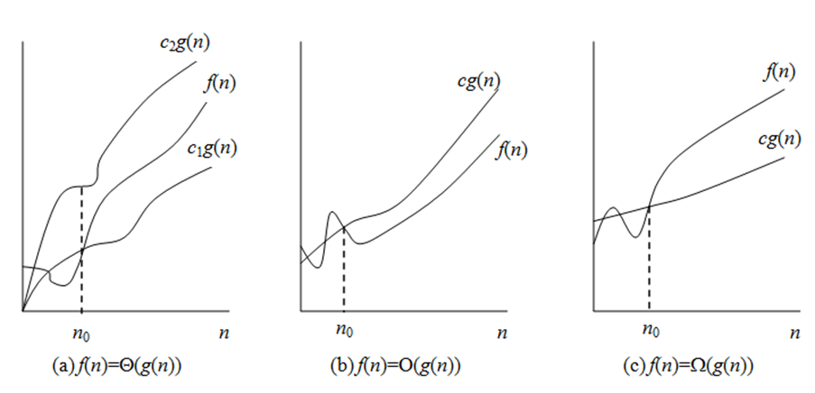

# 算法设计与分析一 概述

### 1.1什么是算法

**1.1什么是算法 ：**

**如果一个算法对其每一个输入实例，都能输出正确的结果并停止，则称它是正确的。**

**算法设计应满足以下几条目标：**

****算法具有以下5个重要特征******：

## **1.2 算法与数据结构**

**算法与数据结构既有联系又有区别。**

**联系：****数据结构是算法设计的基础。算法的操作对象是数据结构，在设计算法时，通常要构建适合这种算法的数据结构。数据结构设计主要是选择数据的存储方式，如确定求解问题中的数据采用数组存储还是采用链表存储等。算法设计就是在选定的存储结构上设计一个满足要求的好算法。

**区别：****数据结构关注的是数据的逻辑结构、存储结构以及基本操作，而算法更多的是关注如何在数据结构的基础上解决实际问题。算法是编程思想，数据结构则是这些思想的逻辑基础。

## 1.3 算法设计的基本步骤**

## **1.4 算法分析**

**算法分析是分析算法占用计算机资源的情况。**

　　**所以算法分析的两个主要方面是分析算法的***时间复杂度*和****空间复杂度****。**

### **1.4.1  时间复杂度分析**

**一个算法是由控制结构（顺序、分支和循环****3****种）和原操作（指固有数据类型的操作）构成的，算法的运行时间取决于两者的综合效果。**

**设*****n*****为算法中的问题规模，通常用大****O****、大****W****和****Q****等三种渐进符号表示算法的执行时间与*****n*****之间的一种增长关系。**

**定义****1****（大****O****符号）****，*****f*****(*****n*****)=O(*****g*****(*****n*****))****（读作“*****f*****(*****n*****)****是*****g*****(*****n*****)****的大****O”****）当且仅当存在正常量****c****和*****n*****0****，使当*****n*****≥*****n*****0****时，*****f*****(*****n*****)≤c*****g*****(*****n*****)****，即*****g*****(*****n*****)****为*****f*****(*****n*****)****的****上界****。**

**大****O****符号用来描述****增长率的上界****，表示*****f*****(*****n*****)****的增长最多像*****g*****(*****n*****)** **增长的那样快，也就是说，当输入规模为*****n*****时，算法消耗时间的最大值。****这个上界的阶越低，结果就越有价值**

**定义****2****（大****W****符号）****，*****f*****(*****n*****)= W(*****g*****(*****n*****))****（读作“*****f*****(*****n*****)****是*****g*****(*****n*****)****的大****W”）当且仅当存在正常量c****和*****n*****0****，使当*****n*****≥*****n*****0****时，*****f*****(*****n*****)≥c*****g*****(*****n*****)****，即*****g*****(*****n*****)****为*****f*****(*****n*****)****的****下界****。**

**大****W****符号用来描述****增长率的下界****，表示*****f*****(*****n*****)****的增长最少像*****g*****(*****n*****)** **增长的那样快，也就是说，当输入规模为*****n*****时，算法消耗时间的最小值。**

​    **与大****O****符号对称，****这个下界的阶越高，结果就越有价值****，**

**定义****3****（大****Q****符号）****，*****f*****(*****n*****)= Q(*****g*****(*****n*****))****（读作“*****f*****(*****n*****)****是*****g*****(*****n*****)****的大****Q”）当且仅当存在正常量c1****、****c2****和*****n*****0****，使当*****n*****≥*****n*****0****时，有****c1*****g*****(*****n*****)≤*****f*****(*****n*****)≤c2*****g*****(*****n*****)****，即*****g*****(*****n*****)****与*****f*****(*****n*****)****的****同阶**

